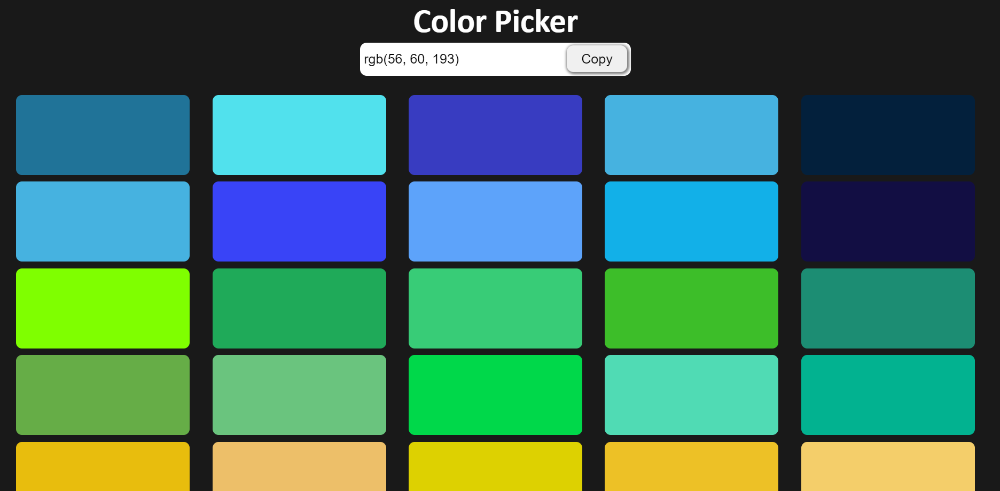
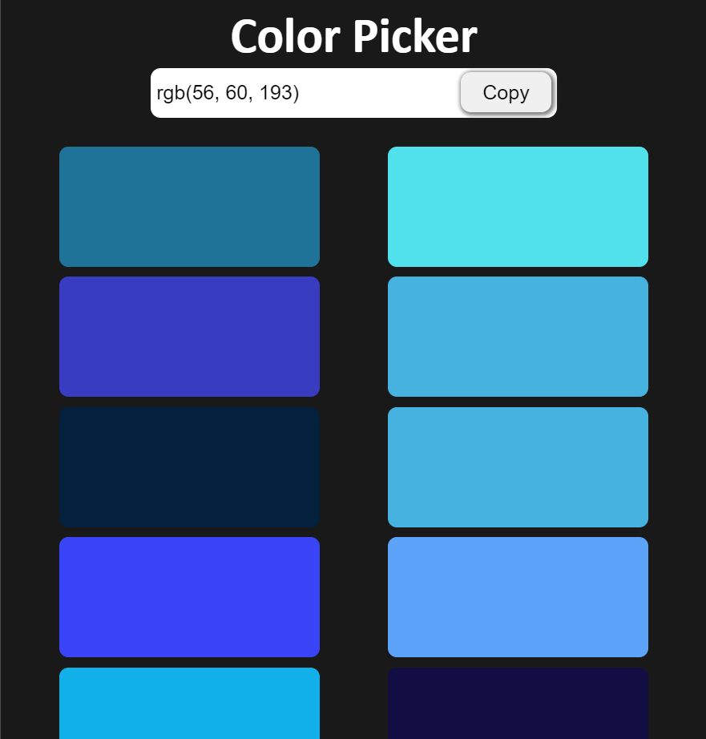
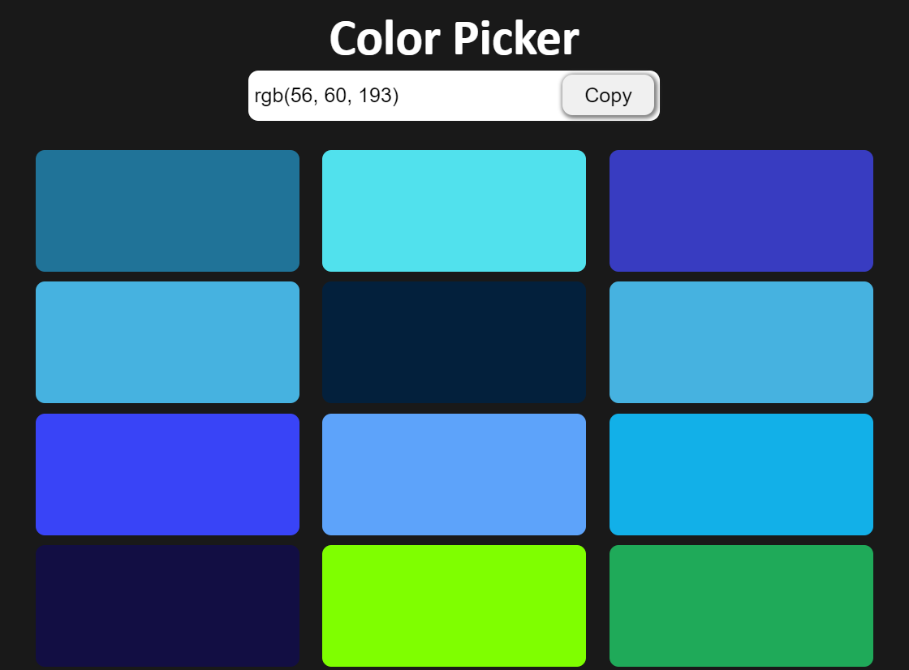

# Color Picker Website
### I have created a Color Picker Website with the help of HTML, CSS, and JavaScript.

 ### You can copy the color code.
 ### Color code is available in rgb format.

 

 
 

Live Link:- [Click here!]()

## Picture of my project:-

## Technology Used:-
  - ` HTML ` 
  - ` CSS ` 
  - ` JS ` 

## It took almost 3 hours to complete.
  